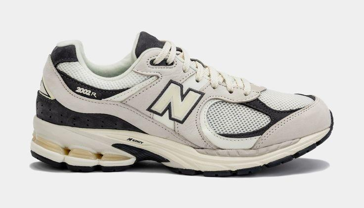
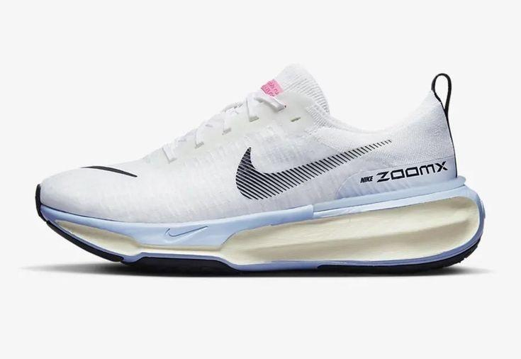
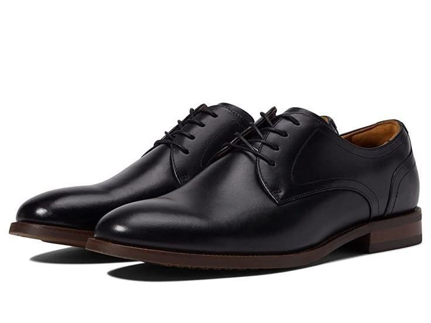
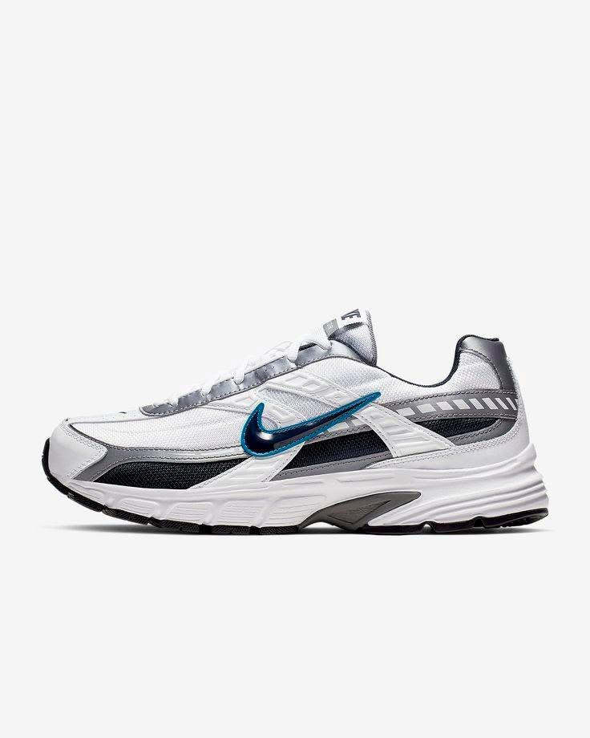

<html lang="en">
<head>
  <meta charset="UTF-8" />
  <meta name="viewport" content="width=device-width, initial-scale=1.0"/>
  <title>Ay na shoes</title>
  
</head>
<body>

  <header>
    <h1>Ay na shoes</h1>
    
Nashoes — Find Your Perfect Pair

  </header>

  <nav>
    <a href="#home">Home</a>
    <a href="#shoes">Shoes</a>
    <a href="#about">About</a>
    <a href="#contact">Contact</a>
  </nav>

  <section class="intro" id="home">
    <h2>Welcome to Ay na shoes</h2>
    
From streetwear to sport-ready, we've got the perfect shoes for you.

  </section>

  <section class="products" id="shoes">
    

      
      <h3>Casual Sneaker</h3>
      
₱1,599

      <button>Add to Cart</button>
    

    

      
      <h3>Running Shoe</h3>
      
₱2,299

      <button>Add to Cart</button>
    

    

      
      <h3>Formal Leather Shoe</h3>
      
₱2,899

      <button>Add to Cart</button>
    

    

      
      <h3>Mens Nike Initiator</h3>
      
₱2,499

      <button>Add to Cart</button>
    

    

      
      <h3>Men's Nike Low Retro</h3>
      
₱1,299

      <button>Add to Cart</button>
    

    

      
      <h3>Nike Precision 6</h3>
      
₱3,199

      <button>Add to Cart</button>
    

    

      
      <h3>Nike Ja 1</h3>
      
₱999

      <button>Add to Cart</button>
    

    

      
      <h3>Limited Edition</h3>
      
₱3,499

      <button>Add to Cart</button>
    

  </section>

  <section class="about" id="about">
    <h2>About Us</h2>
    
Ay na shoes was built for sneakerheads and comfort seekers. We combine style, comfort, and value in every pair.

  </section>

  <section class="contact" id="contact">
    <h2>Contact Us</h2>
    
Email: contact@aynashoes.com Instagram: @aynashoes.ph

  </section>

  <footer>
    &copy; 2025 Ay na Shoes. All rights reserved.
  </footer>

</body>
</html>
